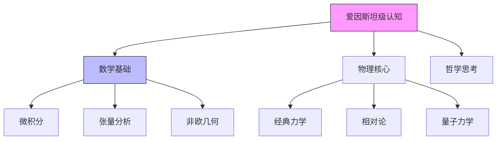

# 技能树与差距分析 (Skill Tree & Gap Analysis)

## 🎯 目标全景图 (SMART Goal Map)

> **目标**: [例如: 达到爱因斯坦层级的物理认知]
> **资源**: [智商 120, 每天2小时]

### 📊 进度可视化 (Knowledge Bar)
*   **总体进度**: ██░░░░░░░░ 20%
*   **当前阶段**: Phase 2 - 基础微积分建立

---

## 🌳 知识与技能树 (Mermaid Skill Tree)

---

## 🌉 差距缩减计划 (The Bridge Plan)

| 关键差距 (The Gap) | 填补行动 (SMART Action) | 预计耗时 | 完成验证 (Proof) |
| :--- | :--- | :--- | :--- |
| **不懂张量分析** | 每天 20:00-21:00 研读《张量分析导论》 | 300 小时 | 能独立推导广义相对论场方程 |
| **缺乏直觉思维** | 每周进行一次"追光思想实验" (Like Einstein) | 52 次/年 | 能用通俗语言解释时空弯曲 |
| - | - | - | - |

## 📈 概率计算 (Probability)
*   **基础成功率**: 0.0001% (成为爱因斯坦是极难的)
*   **努力修正后**: 15% (达到其 *认知水平* 而非 *历史成就*)
*   **关键依赖**: `深度思考时间` > 10,000 小时
