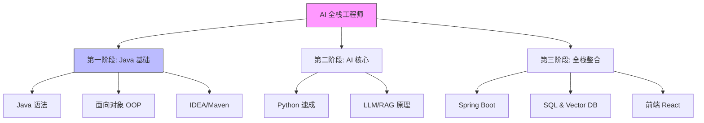

# 技能树与差距分析 (Skill Tree & Gap Analysis)

## 🎯 目标全景图 (SMART Goal Map)

> **目标**: AI 全栈工程师 (Java 后端 + Python AI)
> **当前策略**: "先学 Java" -> 夯实计算机基础与工程逻辑 -> 再进阶 AI

### 📊 进度可视化 (Knowledge Bar)
*   **总体进度**: ░░░░░░░░░░ 0%
*   **当前阶段**: Phase 1 - Java 语言基础 (Se)

---

## 🌳 知识与技能树 (Mermaid Skill Tree)

---

## 🌉 差距缩减计划 (The Bridge Plan)

| 关键差距 (The Gap) | 填补行动 (SMART Action) | 预计耗时 | 完成验证 (Proof) |
| :--- | :--- | :--- | :--- |
| **不懂 Java** | 每天 1 小时 Java SE 练习 | 60 小时 | 能写一个"学生管理系统" (CLI版) |
| **不懂 AI 原理** | (推迟至第二阶段) | - | - |
| **缺乏工程能力** | (推迟至第三阶段) | - | - |

## 📈 概率计算 (Probability)
*   **基础成功率**: 70% (Java 资料极多，适合作为第一门语言建立严谨逻辑)
